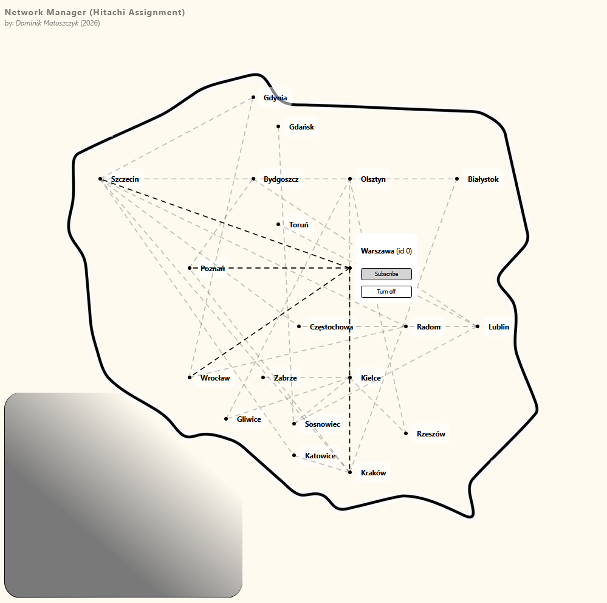
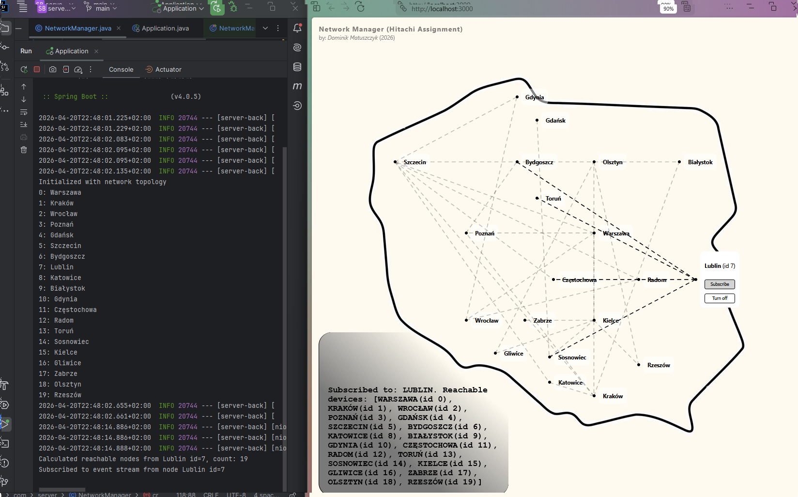
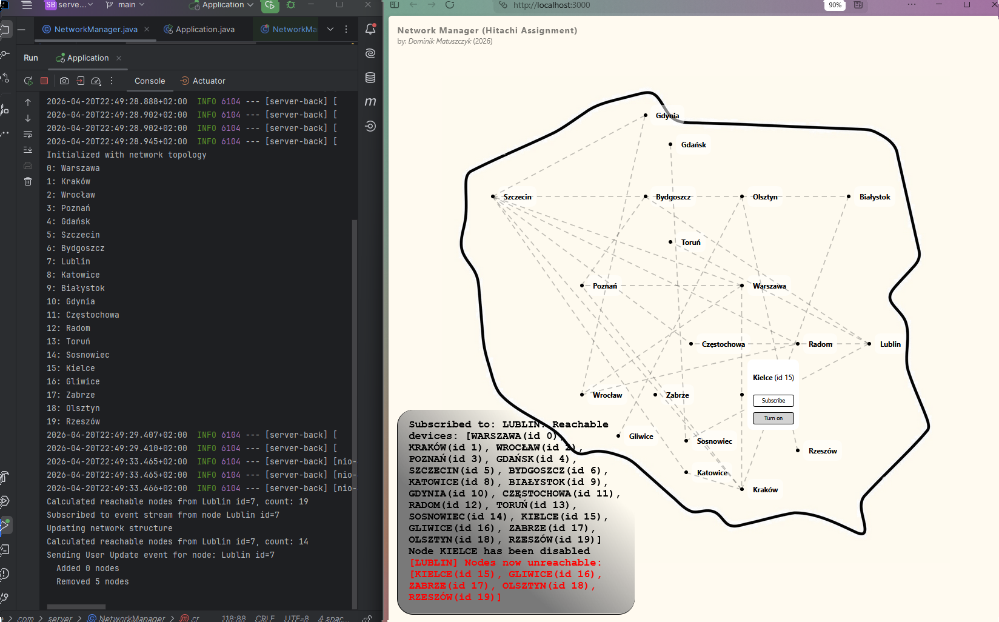
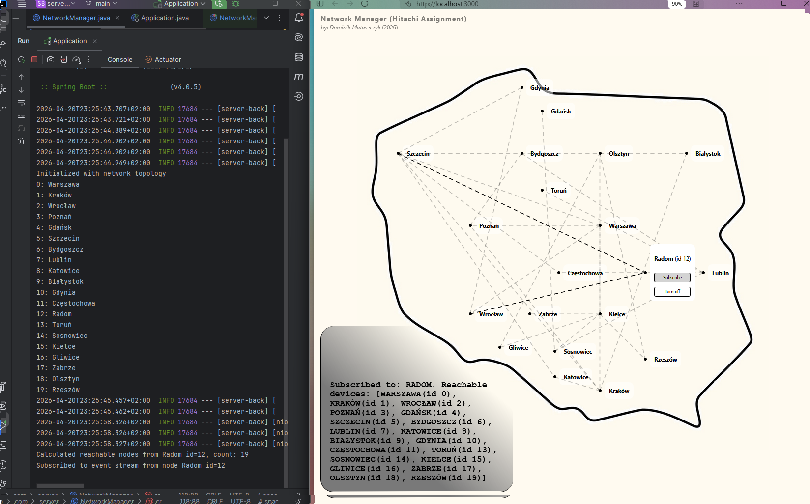
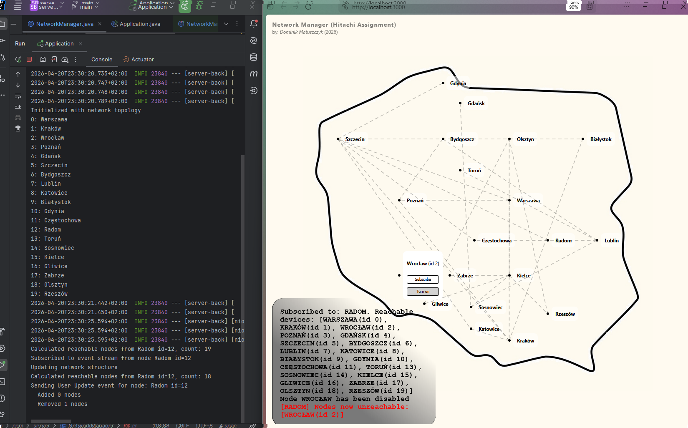
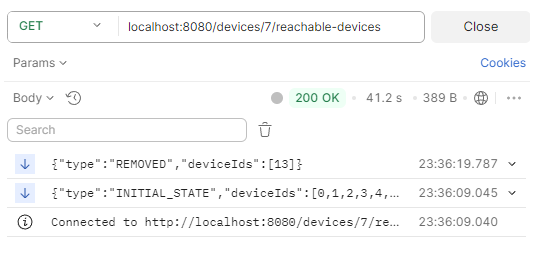
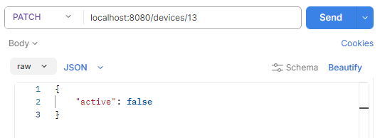
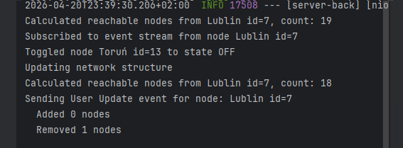
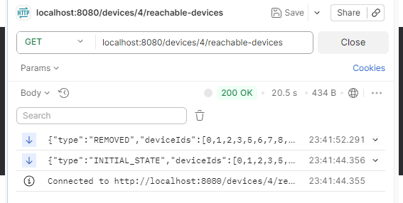
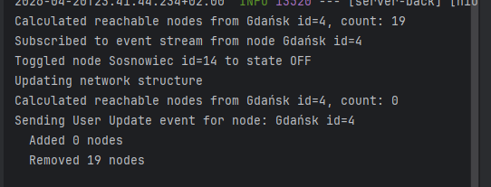

# Simple Network Manager

by $Dominik$ $Matuszczyk$

A web server for managing nodes and receiving network updates via SSE (Server Sent Events). 

--- 

## Functionality

**API**: The server exposes 2 endpoints 

> PATCH /devices/{id}

Modify a device with id=*id*
where flag *active*: boolean can be set

> GET /devices/{id}/reachable-devices`

Server-sent events endpoint providing a real-time
information about devices reachable from device
with id=id. Whenever some device on the path is
turned off and set of reachable devices changes,
that change should be reflected by emitting a new
event

---
**USER INTERFACE**: a simple website with 
nodes setup (somewhat) geographically on a map, for each node the endpoints can be called with buttons



Additionally a console in the bottom left shows all event details in text.

---
**SERVER**: the Java server imports the topology data from a JSON file and initializes the network. With each update (like turning off a node) the server runs a bfs search for all currently subscribed nodes, compared with the previous state and then emits an event.

On subscribing: (*GET /devices/0/reachable-devices*)
``` 
{
    "type":"INITIAL_STATE","
    deviceIds":[1,2,3,4,5,6,7,8,9,10,11,12,13,14,15,16,17,18,19]
}
```

Then a if a node is changed: (like *PATCH /devices/3  ,body:{"active":false*})
the original query returns
```
{
    "type": "REMOVED",
    "deviceIds": [
        3
    ]
}
``` 

## Demonstration

### 1. Sub Lublin, Off Kielce




### 2. Sub Radom, off Wrocław




### 3. Sub Lublin, off Toruń





### 4. Sub Gdańsk, off Sosnowiec




---

# Implementation Details

## Technologies

- **Backend** The Server is build with Spring Boot in Java using Spring Web for the RESTful API. SSE is implemented with Spring WebFlux (project reactor). For reading the JSON input topology I use ObjectMapper from Jackson library.

- **Frontend** The website is built with React + TypeScript

---

## Netowork Structure
The server when parsing the topology data given in JSON converts it into an array of nodes `NetworkNode` each with a neighbor index list. This makes it easy to use BFS later.

I have breifly considered using a routing table for each node but decided for the simplest approach.

For interaction of the `NetworkManager` class with the `RestController` class the first one is defined as a `@Bean` in the Spring App, then a singleton of the class can be passed through the constructor.

---

this project was written as a recruitment assignment for Hitachi Energy. (hopefully updates to follow)

---

## Unit test

A couple of unit test have been written for the `NetworkManager` class and the `FileInputParser` class (2 each).